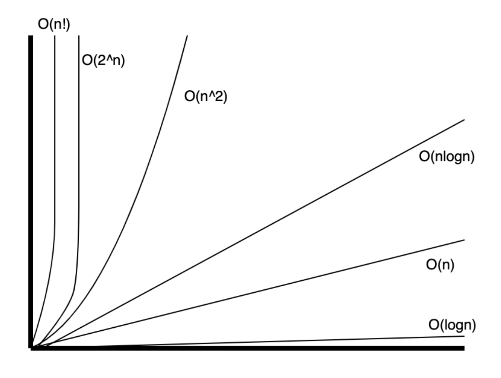
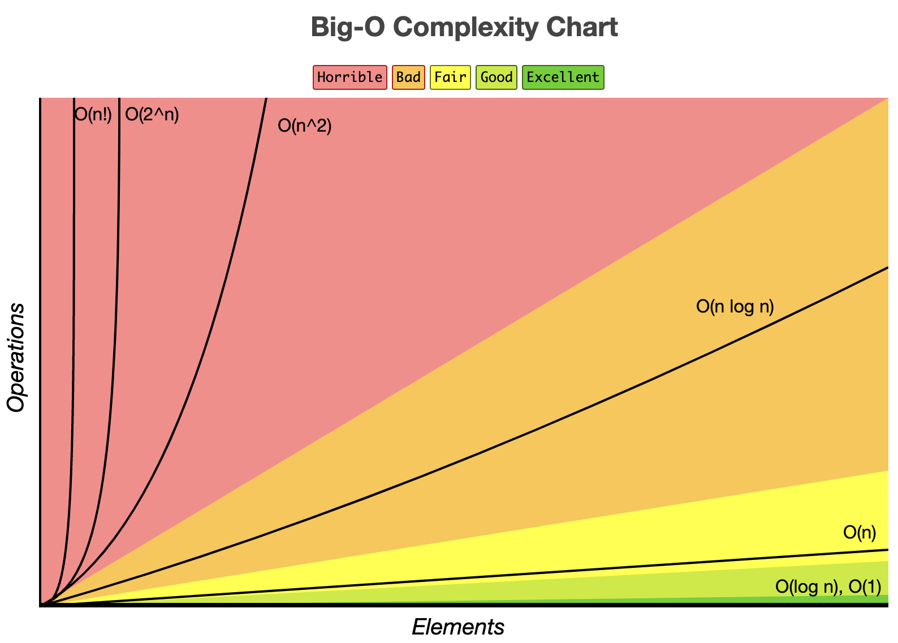

<h1> Big O Notation </h1>
<h2> Table of Contents </h2>

- [Definition](#definition)
- [Time Complexity vs. Space Complexity](#time-complexity-vs-space-complexity)
- [Big-$O$ notation](#big-o-notation)
  - [Key Properties of Big-O](#key-properties-of-big-o)
- [Key Points](#key-points)
- [Calculating Complexity](#calculating-complexity)
  - [Walkthrough example I](#walkthrough-example-i)
  - [Walkthrough example II](#walkthrough-example-ii)
  - [Walkthrough example III](#walkthrough-example-iii)
  - [Walkthrough example IV](#walkthrough-example-iv)
- [Common Complexity Classes (from fastest to slowest)](#common-complexity-classes-from-fastest-to-slowest)
  - [Some examples](#some-examples)
    - [Linear time $O(n)$](#linear-time-on)
    - [Quadratic time $O(n^2)$](#quadratic-time-on2)
    - [Logarithmic time $O(log~n)$](#logarithmic-time-ologn)
    - [Linearithmic time $O(n~log~n)$](#linearithmic-time-onlogn)
    - [Exponential time $O(2^n)$](#exponential-time-o2n)
    - [Factorial time $O(n!)$](#factorial-time-on)
- [Resources](#resources)

## Definition

In computer science, the efficiency of algorithms is analyzed using something called **Algorithmic Complexity**.

It helps us analyze how efficient our code is, both in terms of how long it takes to run (**time**) and how much memory it uses (**space**).

## Time Complexity vs. Space Complexity

**Time Complexity** measures the **amount of time an algorithm takes to complete as a function of the length of the input**. It's an essential factor in determining how well an algorithm scales as the size of the input grows.

**Space Complexity** measures the **amount of memory an algorithm uses as a function of the length of the input**. It considers both the memory needed to store the input and any additional memory required during the execution of the algorithm.

**Space complexity will be constant $O(1)$ when**:

- The function **doesn’t allocate memory proportional to the input** (e.g., it modifies the input in place or performs calculations without additional storage).
- **The return value is not part of the memory analysis** (e.g., in a theoretical "streaming" approach where the set isn't stored).

Both time and space complexities are crucial because they help us understand the efficiency of an algorithm and make informed decisions about which algorithm to use based on the constraints of the problem.

## Big-$O$ notation

**Big-$O$** is a mathematical concept that describes an algorithm's upper bound of growth. It provides an asymptotic guarantee on the maximum rate of growth for time or space complexity as the input size (n) approaches infinity.

### Key Properties of Big-O

1. **Focuses on Growth Rate**: Big-O describes how an algorithm's performance scales, not the exact number of operations.

2. **Drops Constants**: We remove constant multipliers. For example:

   - $2n$ becomes $O(n)$
   - $5n^2$ becomes $O(n^2)$

3. **Keeps Highest Order**: We only keep the term that dominates as n grows large:
   - $n^2 + n + 1$ becomes $O(n^2)$
   - $n^3 + 100n^2$ becomes $O(n^3)$

For example, the time complexity of linear search is $O(n)$, where $ n $ is the number of elements in the array. This is because in the worst case, the algorithm must look at each element once.

Big O notation is useful when comparing algorithms, as it allows us to quantify the performance of an algorithm and understand how it will scale as the size of the input grows.



- Educative.io



- [Big O Cheatsheet](https://www.bigocheatsheet.com/)

## Key Points

1. **Common Usage**:

   - Big-$O$ is **commonly associated with the worst-case performance**, as it ensures the algorithm behaves predictably in the most challenging situations.

2. **Can Describe Other Scenarios**:

   - While most commonly used for worst-case, Big-O can describe other scenarios if explicitly stated.

3. **Other Notations**:
   - **Big-\(\Omega\)**: Represents the **lower bound**, often used for best-case performance.
   - **Big-\(\Theta\)**: Represents the **tight bound**, used when the upper and lower bounds, average-case.

## Calculating Complexity

When analyzing an algorithm's complexity:

1. **Count Basic Operations**:
   - Assignments
   - Comparisons
   - Arithmetic operations
   - Array/object access
2. **Look for Patterns**:
   - Single statements → $O(1)$
   - Single loops → $O(n)$
   - Nested loops → $O(n^m)$ where m is the number of nested levels
   - Dividing input in half → Usually $O(\log n)$
3. **Consider All Cases**:
   - Best case (**Big**-Ω)
   - Average case (**Big**-Θ). This is the most interesting case.
   - Worst case (**Big**-O)

### Walkthrough example I

```python
def find_max(arr):
    max_val = arr[0]        # Initialize max_val with the first element
    for val in arr:         # Iterate through each element in the array
        if val > max_val:   # If the current element is greater than max_val
            max_val = val   # Update max_val to the current element
    return max_val          # Return the maximum value found
```

1. **Identify the input size**: The input size is the length of the array, denoted as $ n $.
2. **Count the operations**:
   - Assign `max_val = arr[0]`: 1 operation.
   - Loop through the array: $ n $ iterations.
   - Compare `val > max_val`: 1 operation.
   - Update `max_val = val`: 1 operation.
   - Return `max_val`: 1 operation.
   - Total operations: $ 1 + n(1 + 1 + 1) + 1 = 3n + 2 $.
3. **Simplify the expression**: The dominant term is $ 3n $, so the time complexity is $ O(n) $.
4. **Conclusion**:
   - Time complexity: $ O(n) $.
   - Space complexity: $ O(1) $.

### Walkthrough example II

```python
def print_pairs(arr):
    for i in range(len(arr)):
        for j in range(len(arr)):
            print(arr[i], arr[j])
```

1. **Identify the input size**: The input size is the length of the array, denoted as $ n $.
2. **Count the operations**:
   - Outer loop: $ n $ iterations.
   - Inner loop: $ n $ iterations.
   - Print `arr[i], arr[j]`: 1 operation.
   - Total operations: $ n(n(1)) = n^2 $.
3. **Simplify the expression**: The dominant term is $ n^2 $, so the time complexity is $ O(n^2) $.
4. **Conclusion**:
   - Time complexity: $ O(n^2) $.
   - Space complexity: $ O(1) $.

### Walkthrough example III

```python
def binary_search(arr, target):
    left, right = 0, len(arr) - 1
    while left <= right:
        mid = left + (right - left) // 2
        if arr[mid] == target:
            return mid
        elif arr[mid] < target:
            left = mid + 1
        else:
            right = mid - 1
    return -1
```

1. **Identify the input size**: The input size is the length of the array, denoted as $ n $.
2. **Count the operations**:
   - Initialize `left, right`: 2 operations.
   - While loop: $ \log_2(n) $ iterations.
   - Calculate `mid`: 1 operation.
   - Compare `arr[mid] == target`: 1 operation.
   - Update `left, right`: 2 operations.
   - Return `-1`: 1 operation.
   - Total operations: $ 2 + \log_2(n)(1 + 1 + 1 + 2) + 1 = 4\log_2(n) + 3 $.
3. **Simplify the expression**: The dominant term is $ 4\log_2(n) $, so the time complexity is $ O(\log n) $.
4. **Conclusion**:
   - Time complexity: $ O(\log n) $.
   - Space complexity: $ O(1) $.

### Walkthrough example IV

```python
def unique_elements(arr):
    unique = set()
    for elem in arr:
        unique.add(elem)
    return unique
```

1. **Identify the input size**: The input size is the length of the array, denoted as $ n $.
2. **Count the operations**:
   - Initialize `unique`: 1 operation.
   - Loop through the array: $ n $ iterations.
   - Add `elem` to `unique`: 1 operation.
   - Return `unique`: 1 operation.
   - Total operations: $ 1 + n(1 + 1) + 1 = 2n + 2 $.
3. **Simplify the expression**: The dominant term is $ 2n $, so the time complexity is $ O(n) $.
4. **Conclusion**:
   - Time complexity: $ O(n) $.
   - Space complexity: $ O(k) $, where $ k $ is the number of unique elements in the array. $ O(1) $ if we don't consider the space for the return value.

## Common Complexity Classes (from fastest to slowest)

| Complexity    | Name         | Description                                     | Example Operations                        |
| ------------- | ------------ | ----------------------------------------------- | ----------------------------------------- |
| $O(1)$        | Constant     | Performance is independent of input size        | Array access, arithmetic                  |
| $O(\log n)$   | Logarithmic  | Input size is repeatedly divided                | Binary search, balanced tree operations   |
| $O(n)$        | Linear       | Performance scales linearly with input          | Linear search, array traversal            |
| $O(n \log n)$ | Linearithmic | Combination of linear and logarithmic           | Efficient sorting (merge sort, quicksort) |
| $O(n^2)$      | Quadratic    | Performance scales with square of input         | Nested loops, bubble sort                 |
| $O(2^n)$      | Exponential  | Performance doubles with each addition to input | Recursive fibonacci, power set            |
| $O(n!)$       | Factorial    | Performance grows factorially                   | Permutations, traveling salesman          |

### Some examples

```python
def print_first_element(arr):
    print(arr[0])
```

#### Linear time $O(n)$

```python
def print_all_elements(arr):
    for elem in arr:
        print(elem)
```

#### Quadratic time $O(n^2)$

```python
def print_all_pairs(matrix):
    for row in matrix:
        for elem in row:
            print(elem)
```

#### Logarithmic time $O(log~n)$

```python
def binary_search(arr, target):
    left, right = 0, len(arr) - 1
    while left <= right:
        mid = left + (right - left) // 2
        if arr[mid] == target:
            return mid
        elif arr[mid] < target:
            left = mid + 1
        else:
            right = mid - 1
    return -1
```

#### Linearithmic time $O(n~log~n)$

```python
def merge_sort(arr):
    if len(arr) <= 1:
        return arr
    mid = len(arr) // 2
    left = merge_sort(arr[:mid])
    right = merge_sort(arr[mid:])
    return merge(left, right)
```

#### Exponential time $O(2^n)$

```python
def fibonacci(n):
    if n <= 1:
        return n
    return fibonacci(n - 1) + fibonacci(n - 2)
```

#### Factorial time $O(n!)$

```python
def factorial(n):
    if n == 0:
        return 1
    return n * factorial(n - 1)
```

## Resources

- https://blog.algomaster.io/
- educative.io
- https://www.bigocheatsheet.com/
